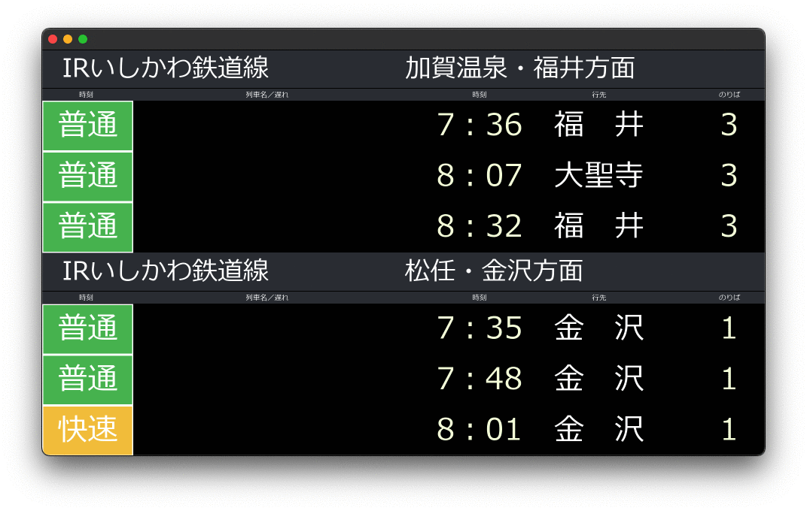

# py-komatsu-lcd-timetable

IRいしかわ鉄道小松駅改札内中2階のLCD発車標を Python / pygame で再現するプロジェクトです。


---



## 必要環境

| 項目 | バージョン |
|------|-----------|
| Python | 3.x |
| pygame | 最新推奨 |
| Requests | 最新推奨 |
| OS | Windows, *nix |
| フォント | メイリオ |

## インストール

```zsh
git clone https://github.com/awazustamin/py-komatsu-lcd-timetable.git
cd py-komatsu-lcd-timetable
pip install -r requirements.txt
```

## 使い方

```zsh
python main.py
```

起動するとウィンドウが開き、発車標が表示されます。   
また、`--debug`を追加すると時刻の変更ができます。   
時刻・行先・のりばの変更については次章をご参考ください。  

| 操作 | 動作 |
|------|------|
| ウィンドウリサイズ | 16:9 を維持してスケーリング |
| ウィンドウを閉じる | アプリ終了 |
| Bキー | 時間を10分送る |
| Gキー | 時間を10分戻す |
| Nキー | 時間を60分送る |
| Hキー | 時間を60分戻す |

### 起動例

```zsh
# 通常起動
python main.py

# デバッグモード
python main.py --debug

# 任意のJSONを読み込む
python main.py --file example.json

# デバッグモード + 任意のJSON
python main.py --debug --file example.json
```

### 時刻・行先・のりばを変更する

一度起動すると、`main.py`と同じディレクトリーに`komatsu.json`が作成されます。  
それを複製して内容を書き換えてください。

書き換えたファイルは、`--file`オプションで指定して読み込めます。起動方法については「起動例」をご覧ください。

### JSON形式

JSONの構造は`komatsu.json`と同じ形式です。  
キー名や階層構造は変更せず、各値を書き換えてご利用ください。

## ライセンス

[MIT License](LICENSE)
